# Guns and Bullets 2
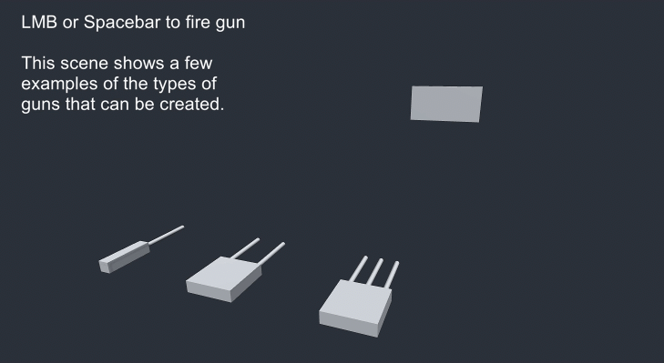

This project is a set of generic gun and bullet components to be futher expanded upon for specific projects. They are designed around my usual use case of fast moving bullets fired from vehicles.

The goal of this project was to create a sort of "canonical" version of bullet and gun code that I so frequently write and rewrite. Rather than constantly pulling and gutting code from old projects, it'd be nice to have a single package that I can just import.

## Features:
* Guns with optionally **limited ammo**
* Bullets can be fired with **random deviation**
* Simple handling for effects such as **muzzle flashes and impacts**
* Guns can have **multiple barrels** that are fired simultaneously or sequentially
* "Physical" bullets with **travel time**
* **Gimballing** to allow for auto-aim style mechanisms
* Option for **thick bullets** to test bullets with volume
* Architecture allows for accurate **prediction** of impact point
* Bullets can **inherit motion** automatically from a parent Rigidbody
* Optional ability for bullets to **ignore specific objects** to prevent shooting yourself
* Optional ability to **self destruct** on timeout
* Bullets have **length** to them, for more visually accurate hit detection
* Optional **gravity and drag** for bullets, that also work with prediction
* Support for **Rigidbody interpolation and movement**
* Barrels can be given procedural **recoil** for cooler visuals

This project was built in **Unity 6000.0.70f1**.

## Download
You can either clone the repository or [download the asset package](https://github.com/brihernandez/GunsAndBullets2/raw/refs/heads/master/GunsAndBullets2.unitypackage) located in the root.

## How I use this repository/package

1. I am making a very quick prototype and I don't care that much about how the guns or bullets work. In that case, I just drop the whole package directly into the project and use the guns/bullets directly.
2. The project I'm working on has some specific requirements of its guns/bullets, but I will often reference the code from this repository and copy/paste snippets as needed.

The code here isn't super-optimized, because the most optimized solution will always be something tailor made for your project and your requirements. However, I did spend some time making sure what's here is reasonably optimized for how flexible they are designed to be.

Honestly, as long as you aren't doing something crazy with thousands of bullets flying through the air, I am confident in saying that I think this is practically shippable code. Throw some kind of pooling on the bullets and effects, and I would say this *is* shippable code.

# Guns
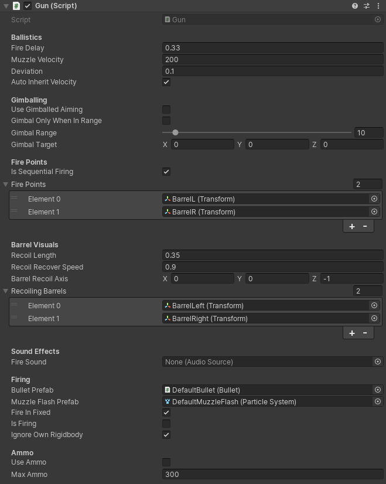

The guns themselves are pretty straightforward. They fire automatically at a set rate of fire as long as `IsFiring` is set to true. If only a single shot is desired, the `FireSingleShot()` function can be used.

Using `GetPredictedImpactPoint()`, the exact path of a bullet can be predicted. See [Prediction](#Prediction) for more information.

The gun uses a **Fire Point** system to determine where bullets and muzzle flashes are to be placed. This allows for weapons with multiple fire points. If no fire points are assigned (`FirePoints` array is left empty), then the gun will fire bullets from whatever `Transform` the `Gun` script is attached to. Fire points can be fired simultaneously, or sequentially.

Ammo can optionally be used to limit the number of shots the gun can fire. To reload a gun to its maximum ammo count, call `ReloadAmmo`.

## Ignoring Collisions
Bullets have several options for blacklisting Rigidbodies and Colliders from their own hit detection. The most common use for this, is to prevent a bullet from shooting the thing it fired it. This information cannot be filled out automatically, so the `Gun` will pass that information to the `Bullet` when it is fired.

By default, a gun will try to get a reference to a parent `Rigidbody`. If the firing object has a Rigidbody, this is enough, and the **preferred** method. If any additional rigid bodies need to be ignored, the `AddIgnoredRigidbody` function can be used.

If the firing object **does not** have a `Rigidbody`, then the `AddIgnoredCollider` function can be used to add a list of colliders for the bullet to ignore. This must be called manually, typically by whatever object is firing the gun. The list is persistent, so it only needs to be set once.

## Gun Limitations
As with the bullets, I feel this component is generic enough to cover 90% of the use cases I'm interested in with little to no modification. However, there is one caveat to keep in mind:

Fire rate is handled by checking time since the last shot, once every frame. This means that a gun **cannot fire faster than its update loop**. When firing from FixedUpdate, this translates to whatever your `Fixed Timestep` is set to in project properties. By default, this is `0.02`. For extremely fast firing guns, the code must be extended, the rate of updates increased. The problem can also be somewhat worked around by firing from multiple fire points at the same time.

If you start running into this limitation, you should also consider if you really *need* that many bullets flying in the air, as ultra-high rates of fire coming from enough guns can saturate a game with enough raycasts to slow it down.

## Recoiling Barrels


Barrels can optionally be configured to recoil upon firing. To enable this feature, add the `Transform` of the barrel object to the `RecoilingBarrels` list.

To work correctly with multiple fire points, make sure to assign this list in the same order as the `FirePoints` list. E.g. if you have a left and right fire point in the `FirePoints` list, add the left and right barrels to `RecoilingBarrels` in that same order.

Upon firing, barrels will translate backwards in the local Z axis.

There are no checks to make sure the barrel gets fully reset after each shot. If the fire rate fast enough that the barrel doesn't have enough time to reset, it'll be continually pushed backwards!

# Bullets
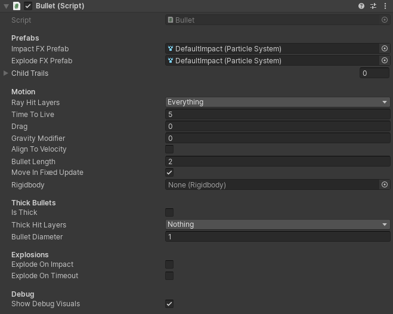

Below is miscellaneous technical documentation.

## The Functions
The most important functions describing how the bullets work are these three:

* `CalculateBulletMotion`
* `RunRayHitDetection`
* `RunThickHitDetection`

These three functions get used in the `UpdateBullet` function to both move it and detect if the bullet has hit an object. Since these functions **do not** rely on any state information held in the bullet itself, they can be called with any arbitrary starting positions to run the bullet for **one frame**. In normal use, this just means it gets called in the `FixedUpdate` loop, but they can also be used to simulate a hypothetical bullet, its flight path, and a point it may hit.

### CalculateBulletMotion
Straightforward function for linear bullets with optional gravity and drag modifiers. Anything more is too project-specific, so it's up to you to specify if need be. I find that this type of motion is good enough for the vast majority of cases.

#### Gravity
For bullets with no gravity, the simple Euler Method (i.e. `position + velocity * deltaTime`) is applied for bullets, for the fastest calculations possible. For bullets with gravity, [Velocity Verlet](https://en.wikipedia.org/wiki/Verlet_integration#Algorithmic_representation) is used due to it being significantly more accurate than Euler Method, especially with longer steps between each update. In my testing, Velocity Verlet is able to perfectly predict bullets with a 0.1 timestep that the Euler Method would requires a 0.02 timestep to achieve.

#### Drag
Draggy bullets use a modified, and more expensive version of Velocity Verlet in order to keep them as consistent as possible. Sometimes though, substepping is required if you care about accurate prediction with larger timesteps. See the [Draggy Bullets](#draggy-bullets) subsection for more information.

### CalculateRayHitDetection
One of the hit detection methods. This uses a very simple [Raycast](https://docs.unity3d.com/ScriptReference/Physics.Raycast.html) forwards one frame to see if the bullet will hit something. The raycasting allows for bullets to never tunnel through an object due to high speeds.

### CalculateThickHitDetection
The alternative hit detection method. Instead of a raycast, this uses a [SphereCast](https://docs.unity3d.com/ScriptReference/Physics.SphereCast.html) for hit detection. This method is more expensive, but can be more robust and useful for things such as visibily large bullets or a form of making hit detection more forgiving.

For both optimization and game-design purposes, **thick hit detection only checks layers specified on the `ThickHitLayers` property**. See the [ThickBullets section](#Thick-Bullets) for more details.

## Damage
This project **does not** include any kind of damage system. This is implementation specific, so you will need to add your own code for handling damage. There are two convenient places to place handling damage code marked with `//TODO:` comments. There are two types of damage:

### Impact Damage
Impact damage, to be implemented in the `HandleImpactDamage()` function, is triggered whenever the bullet hits something as defined by `RayHitLayers`.

### Explosion Damage
Using the `ExplodeOnImpact` and `ExplodeOnTimeout` properties, bullets can be set to explode. Functionality for this is very limited, since the exact needs of an explosion system vary depending on the project. As with damage, it is expected for a user to fill in their own code for handling damage.

Explosion damage is to be implemented in the `HandleExplosionDamage()` function.

Explosion damage is not mutually exclusive with impact damage. If a bullet explodes on impact, it will deal both impact damage **and** explosion damage. This is how I typically handle it, because I like having impacts deal "bonus" damage for explosive weapons, and a purely explosive weapon can still be created by setting impact damage to zero.

Explosions and impacts are configured to use different effects, which can be specified using the `ExplodeFXPrefab` and `ImpactFXPrefab` properties.

## Moving in FixedUpdate vs. Update
The rule of thumb for this is: if you are using a physics based project, you will need to set `MoveInFixed` to `true`. If the bullets are updating in a different update loop from the rest of the game, they will move in a very stuttery fashion. This is a very deep topic with a lot of nuance which will depend on your game, so experiment with what works best for you.

As nearly all my projects are physics-based and sensitive to high speeds and timing, this defaults to true.

If you are using Rigidbody interpolation for your player GameObjects, or need to see bullets move in the Update loop, but still *physically* move in the FixedUpdate loop for maximum stability, [Rigidbody Interpolation](#rigidbody-interpolation) has been added in 1.4.

## Rigidbody Bullets
If a Rigidbody is added to the bullet, then movement of the bullet will be done through [Rigidbody.MovePosition](https://docs.unity3d.com/6000.0/Documentation/ScriptReference/Rigidbody.MovePosition.html) rather than by directly moving their transforms. This allows you to take advantage of Rigidbody non-movement related features such as collision detection events or [interpolation](#rigidbody-interpolation).

## Bullet Limitations
The code in this project is very simple. While it is generic enough to cover what I feel is 90% of use cases involving fast bullets, there are some limitations to keep in mind.

1. This solution is designed around bullets that will be traveling at fast speeds relative to their targets. If the targets travel at similar speeds, or faster, than the bullets, then it is possible for the hit detection to be unreliable, particularly when using the ray versions of hit detection.
2. Neither the bullets, nor the impact effects, are pooled. Pooling is too project specific and opinionated a solution for me to feel comfortable including one in here. If you commonly firing/destroying hundreds of bullets a second, you should consider writing a pooling system for the bullets. The `Bullet.Fire()` and `DestroyBulletX()` series of functions are designed with this in mind, to make it easy to adapt to your project's pooling and reset a bullet's state.
3. For an optimization reason, gravity is only considered in the Y direction. Any gravity in the X or Z components is ignored by bullets with gravity.

# Special Bullet Features
This project contains many special little features that I've come to find useful in the types of games I make.

## Gimballing
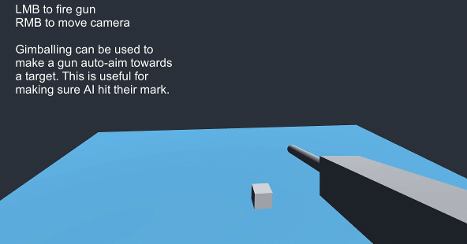

An optional feature that I often find myself repeatedly implementing is gimballing guns. The idea behind this is to allow the gun to hit a precise point without necessarily aiming the gun directly at that point. This is very useful for things such as auto-aim, AI controlled weapons, and ensuring that guns converge on a crosshair.

Set `UseGimballedAiming` to `true` to enable gimballed aiming.

`GimbalTarget` is the position the gun will try to fire bullets at when gimballing is enabled.

`GimbalRange` is the maximum degrees off boresight that the gun can gimbal bullets towards.

Set `GimbalOnlyWhenInRange` iif you want the gun to aim at `GimbalTarget` **only** when it is within the `GimbalRange`.

## Thick Bullets
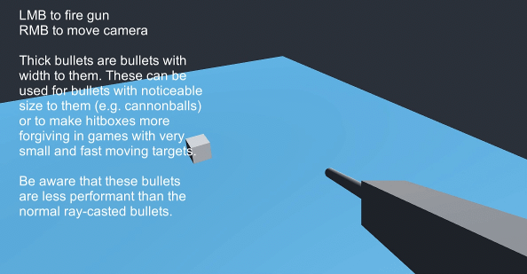

Another optional feature of bullets is to use "thick bullets." Rather than point raycasting, they instead use spherecasts to simulate bullets with volume. This is more expensive than the normal point raycasting, and performs the [SphereCasts](https://docs.unity3d.com/ScriptReference/Physics.SphereCast.html) *in addition* to the point raycasts.

Aside from being used to simulate large bullets (such as a cannon ball), it can be also be used to exaggerate the size of hitboxes to make hitting small and fast targets easier for the player.

**Thick hit detection is only done against objects on the layers defined by `ThickHitLayers`!**

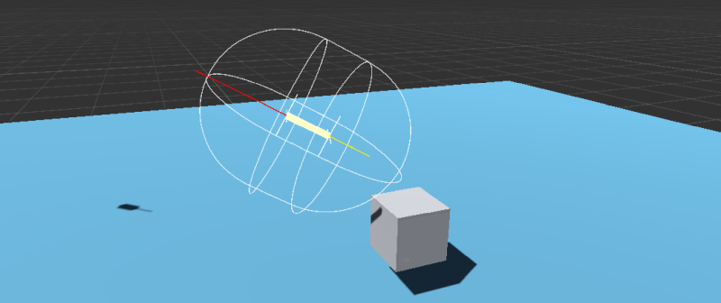

Set `IsThick` to enable thick bullet hit detection using the diameter set by `BulletDiameter`.

#### Setting the Layers
`ThickHitLayers` are the layers that thick hit detection is used for. This is **separate** from normal hit detection for game design and optimization reasons. When thick bullets use the same hit detection as everything else, they will get caught on terrain or the environment in sometimes undesirable ways. Thick bullets using separate hit detection allows them to do the SphereCasts only for relevant objects (e.g. hitboxes).

Keep in mind that the SphereCasts are done **in addition** to normal bullet hit detection. If you'd like all hit detection to be done thick, then make sure to set the `RayHitLayers` mask to `Nothing`.

## Prediction
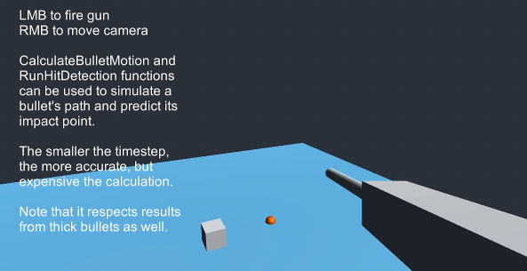

A normal bullet uses the `CalculateBulletMotion` and `RunHitDetection` functions to step through its motion and hit detection in a `FixedUpdate` function. Since these functions do **not** rely on the current state of the bullet, they can be used by other classes to simulate a bullet and have it step through all of its normal code, using its properties.

In this project, the `Gun` class has a `GetPredictedImpactPoint()` function which does exactly this. This simulates a shot from the gun with the guns own parameters, and the bullet prefab that it uses.

Since the `GetPredictedImpactPoint()` function is using exactly the same hit detection and motion functions that the bullet itself uses, any additions to bullet motion such as complex drag models or hit detection will automatically be used.

The smaller the timestep passed into the `GetPredictedImpactPoint()` function, the more accurate the prediction. To get the most accurate prediction, use the same timestep as the [Physics timestep set in Project Settings](https://docs.unity3d.com/Manual/class-TimeManager.html). Be aware that this can become an expensive function, especially for long lasting bullets at low timesteps, since it is essentially running the entire bullet's lifetime in the course of one frame.

In order to use Prediction, `UseAccurateBallistics` must be set to true!

Prediction is meant to be used against static objects such as terrain and buildings. It will not predict an impact point against a target in motion.

```csharp
while (simTime < maxSimTime && !willHitSomething)
{
    (simPosition, simVelocity, simAcceleration) = BulletPrefab.CalculateBulletMotion(
        simPosition, simVelocity, simAcceleration,
        timestep, substeps);

    (willHitSomething, hitInfo) = BulletPrefab.RunHitDetection(
        simPosition, simVelocity,
        timestep);

    if (willHitSomething)
        willHitSomething = true;

    simTime += timestep;
}
```

## Automatically Inherit Velocity
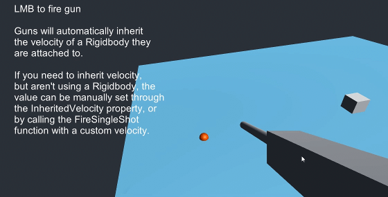

Set `AutoInheritVelocity` to `true` to enable fired bullets from a gun inheriting the velocity of their gun's parent.

Velocity inheritance is accomplished by getting the `Rigidbody` in its parent. Inheriting velocity is realistic, but can be undesirable in some cases, so this is left optional.

If you have a specific value you'd like to use for inherited velocity, or you are **not** using a `Rigidbody`, the inherited velocity can be manually overridden by setting the public `InheritedVelocity` property.

## Ignoring Collision with Objects
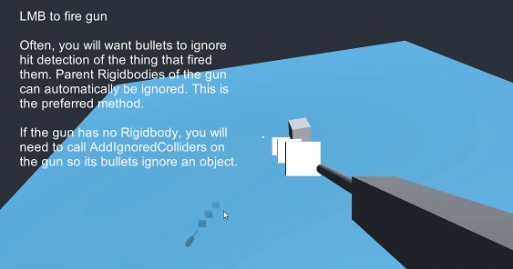

It's often that you will want a projectile to not collider with the object that fired it. Before a `Bullet` is fired, the functions `AddIgnoredRigidbody` and `AddIgnoredCollider` can be used to set exceptions for the bullet's hit detection. When possible, prefer ignoring a `Rigidbody` since it's more robust and slightly more performant than ignoring specific `Collider`s.

See [Ignoring Collisions](#ignoring-collisions) for more details on usage.

##### `IgnoreOwnRigidbody`
The `Gun` class contains convenience functions to automatically ignore its own `Rigidbody` when firing bullets. If you'd like to shoot yourself, set this property to `false`.

## Bullet Length

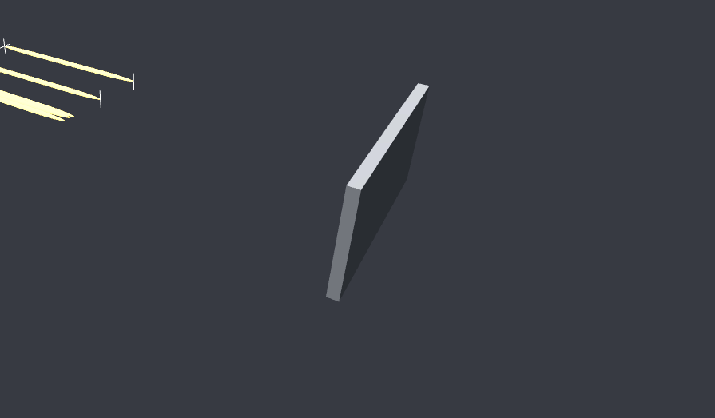

Since the origin of the bullet GameObject is used for hit detection, it can be useful to offset the hit detection forwards by the length of the bullet, especially for longer bullets. This can prevent the visuals of a bullet from intersecting an object before it counts as a collision. This can also make collision detection *feel* more correct from the player's perspective as a perceived "late" hit can feel unresponsive.

The above image shows an example of what this prevents. The two bullets furthest from the camera have their `BulletLength` value set to the length of their bullets, while the three nearest to the camera use the default value.

To use this correctly:

1. Align the visuals of your bullet such that the "tail" of the bullet is at the origin, and the "head" of the bullet is somewhere in the Z+ direction.
2. Enable `Show Debug Visuals` to show the bullet length crosses.
3. Adjust the `BulletLength` property so that the front cross aligns with the front tip of your bullet.

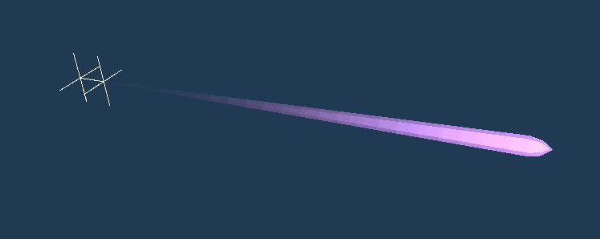

## Rigidbody Interpolation

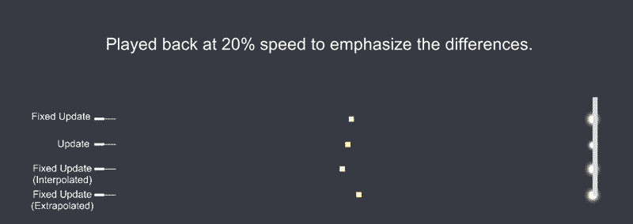

New in 1.4, bullets now support moving with kinematic Rigidbody components attached. The main purpose for this is to allow for [Rigidbody Interpolation](https://docs.unity3d.com/6000.0/Documentation/Manual/rigidbody-interpolation.html). To use interpolation, the bullet must be a [Rigidbody based bullet](#rigidbody-bullets) and have `Interpolate` set to either `Interpolate` or `Extrapolate`. Whether or not you *should* be using interpolation will heavily depend on your project, but this is a feature that I've found myself relying on more and more recently, so I wanted to make sure it was an option here to save myself the trouble of modifying the code all the time.

## Draggy Bullets

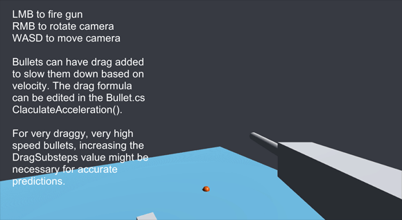

New in 1.4, bullets can have drag to slow them down. The drag is done through a simple linear drag because personally I find it more predictable and intuitive. The `CalculateAcceleration()` function can be modified to change the drag model.

As drag depends on velocity, the [Velocity Verlet](https://en.wikipedia.org/wiki/Verlet_integration#Algorithmic_representation) approach doesn't quite work. When drag is enabled on a bullet, a modified version is used which estimates future velocities and accelerations. This is totally transparent if you aren't messing with the `CalculateBulletMotion()` function, but it's good to be aware of, because draggy bullets are the most expensive thing in this repository.

If you need to predict impact points with draggy bullets, it might be necessary to use **substepping**. The `GunPrediction` component in this scene shows an example of how substeps can be used to increase the accuracy of predictions made with draggy bullets. For bullets with only light drag, the kind you'd see in a realistic environment, it's actually possible to get away with no substepping. The demo uses a very extreme example of bullet drag which really stresses the prediction.

It's also important to note that, for performance reasons, substepping is *only* on the bullet motion, **not** the hit detection. The `Gun.GetPredictedImpactPoint()` takes both a `timestep` and `substep` parameter. The `timestep` defines how long the bullet is simulated between hit detection sweeps. The `substep` defines how many `CalculateBulletMotion()`s run between those hit detection sweeps, providing for much more accurate motion, but without the full impact of also doing too much more hit detection checks. As with most things, experiment to see what values work best, but again, for most things with more realistic amounts of drag, you might be able to get away with no substepping at all.

Generally, I don't really recommend you have bullets with drag on them because it can create a lot of headaches, especially if you have NPCs firing bullets with drag. That said, it can make for some interesting knobs to tweak for balance and design.

# Changelog

### 1.4 (July 23 2026)
- Updated to Unity 6000.0.70f1
- When built, demos can switched between with the number keys
- Tweaked descriptions on all the demos
- Added new demos for [rigidbody interpolation](#rigidbody-interpolation) and [drag](#draggy-bullets)
- Added `[Min]` attribute guards for relevant properties
- If a bullet is assigned a Rigidbody, it will use the Rigidbody to move instead of the Transform
- Bullets with gravity will use Velocity Verlet instead of the Euler Method
- Bullets with drag will use a modified Velocity Verlet with optional substepping
- Fixed null Rigidbodies potentially getting added to the ignored Rigidbody/Collider lists
- Updated visuals for drawing thick bullets to better represent their SphereCasts
- New, simpler .gitignore
- Many optimizations to hit detection to make the Physics raycasts themselves the bottlenecks
- Added a little ammo counter to the ammo gun in the demo scenes it's used in
- Rigidbody movement demo now has the same cursor/movement behavior as the other free camera guns
- Renamed `Bullet.ExplodeBullet()` to `Bullet.DestroyBulletFromExplosion()` for consistency with the other two Destroy functions
- Removed deviation from the demo guns with prediction spheres
- Added tooltips to the `Bullet.ExplodeOnImpact` and `Bullet.ExplodeOnTimeout` to make it clear they are intended to cause damage

### 1.3 (September 22 2021)

- Bullets can now have their hit detection offset by their length

### 1.2 (July 30 2021)

- Fixed bug where explosion effect wasn't being called on explosion

### 1.1 (Mar 7 2021)

- Added optional ability for barrels to recoil from guns
- Changed the language around such that "fire points" are where bullets come from, "barrels" are visual things that recoil
- Firing no longer uses queues and instead just cycles indices in order to take up neglibly less resources
- Fixed bug where setting the gun to use the normal Update (as opposed to FixedUpdate) would result in uncontrolled firing
- Added new test scene demonstrating the recoiling barrels

### 1.0 (Jan 31 2021)

- Released
