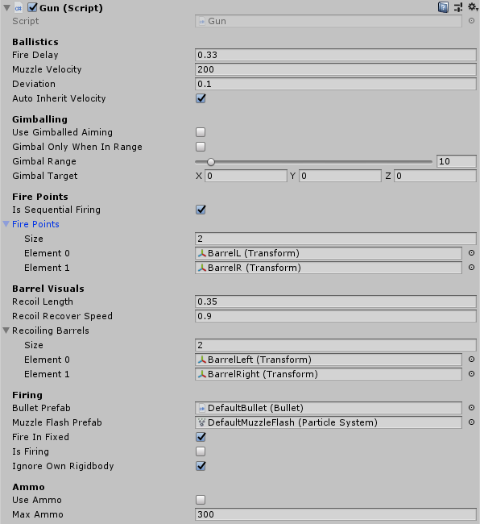
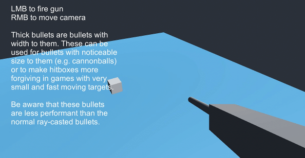

# Guns and Bullets 2
This project is a set of generic gun and bullet components to be futher expanded upon for specific projects. They are designed around my usual use case of fast moving bullets fired from vehicles.

The goal of this project was to create a sort of "canonical" version of bullet and gun code that I so frequently write and rewrite. Rather than constantly pulling and gutting code from old projects, it'd be nice to have a single package that I can just import.

## Features:

* Guns with optionally **limited ammo**
* Bullets can be fired with **random deviation**
* Simple handling for effects such as **muzzle flashes and impacts**
* Guns can have **multiple barrels** that are fired simultaneously or sequentially
* "Physical" bullets with **travel time**
* **Gimballing** to allow for auto-aim style mechanisms
* Option for **thick bullets** to test bullets with volume
* Architecture allows for accurate **prediction** of impact point
* Bullets can **inherit motion** automatically from a parent Rigidbody
* Optional ability for bullets to **ignore specific objects** to prevent shooting yourself
* Optional ability to **self destruct** on timeout


This project was built in **Unity 2018.4.30f1**.

## Download
You can either clone the repository or [download the asset package](./GunsAndBullets2.unitypackage) located in the root.

# Guns



The guns themselves are pretty straightforward. They fire automatically at a set rate of fire as long as `IsFiring` is set to true. If only a single shot is desired, the `FireSingleShot` function can be used.

Using `GetPredictedImpactPoint`, the exact path of a bullet can be predicted. See [Prediction](#Prediction) for more information.

The gun uses a **Fire Point** system to determine where bullets and muzzle flashes are to be placed. This allows for weapons with multiple fire points. If no fire points are assigned (`FirePoints` array is left empty), then the gun will fire bullets from whatever `Transform` the `Gun` script is attached to. Fire points can be fired simultaneously, or sequentially.

Ammo can optionally be used to limit the number of shots the gun can fire. To reload a gun to its maximum ammo count, call `ReloadAmmo`.

## Ignoring Collisions

Bullets have several options for blacklisting Rigidbodies and Colliders from their own hit detection. The most common use for this, is to prevent a bullet from shooting the thing it fired it. This information cannot be filled out automatically, so the `Gun` will pass that information to the `Bullet` when it is fired.

By default, a gun will try to get a reference to a parent `Rigidbody`. If the firing object has a Rigidbody, this is enough, and the **preferred** method. If any additional rigid bodies need to be ignored, the `AddIgnoredRigidbody` function can be used.

If the firing object **does not** have a `Rigidbody`, then the `AddIgnoredCollider` function can be used to add a list of colliders for the bullet to ignore. This must be called manually, typically by whatever object is firing the gun. The list is persistent, so it only needs to be set once.

## Limitations
As with the bullets, I feel this component is generic enough to cover 90% of the use cases I'm interested in with little to no modification. However, there is one caveat to keep in mind:

1. Fire rate is handled by checking time since the last shot, once every frame. This means that a gun **cannot fire faster than its update loop**. When firing from FixedUpdate, this translates to whatever your `Fixed Timestep` is set to in project properties. By default, this is `0.02`. For extremely fast firing guns, the code must be extended, the rate of updates increased. The problem can also be somewhat worked around by firing from multiple fire points at the same time. 

If you start running into this limitation, you should also consider if you really *need* that many bullets flying in the air, as ultra-high rates of fire coming from enough guns can saturate a game with enough raycasts to slow it down.

## Recoiling Barrels


Barrels can optionally be configured to recoil upon firing. To enable this feature, add the `Transform` of the barrel object to the `RecoilingBarrels` list.

To work correctly with multiple fire points, make sure to assign this list in the same order as the `FirePoints` list. E.g. if you have a left and right fire point in the `FirePoints` list, add the left and right barrels to `RecoilingBarrels` in that same order.

Upon firing, barrels will translate backwards in the local Z axis.

There are no checks to make sure the barrel gets fully reset after each shot. If the fire rate fast enough that the barrel doesn't have enough time to reset, it'll be continually pushed backwards!

# Bullets


Below is miscellaneous technical documentation.

## The Functions
The most important functions describing how the bullets work are these three:

* `CalculateBulletMotion`
* `RunRayHitDetection`
* `RunThickHitDetection`

These three functions get used in the `UpdateBullet` function to both move it and detect if the bullet has hit an object. Since these functions **do not** rely on any state information held in the bullet itself, they can be called with any arbitrary starting positions to run the bullet for **one frame**. In normal use, this just means it gets called in the `FixedUpdate` loop, but they can also be used to simulate a hypothetical bullet, its flight path, and a target it may hit.

### CalculateBulletMotion
Straightforward function for linear bullets with optional gravity modifier to take gravity into account. There is no calculation for drag or anything more complex than that. Anything more is too project-specific, so it's up to you to specify if need be. I find that this type of motion is good enough for the vast majority of cases.

### CalculateRayHitDetection
One of the hit detection methods. This uses a very simple [Raycast](https://docs.unity3d.com/ScriptReference/Physics.Raycast.html) forwards one frame to see if the bullet will hit something. The raycasting allows for bullets to never tunnel through an object due to high speeds.

### CalculateThickHitDetection
The alternative hit detection method. Instead of a raycast, this uses a [SphereCast](https://docs.unity3d.com/ScriptReference/Physics.SphereCast.html) for hit detection. This method is more expensive, but can be more robust and useful for things such as visibily large bullets or a form of making hit detection more forgiving.

For both optimization and game-design purposes, **thick hit detection only checks layers specified in the bullet's `TargetMask` property**. See the [ThickBullets section](#Thick-Bullets) for more details.

## Damage
This project **does not** include any kind of damage system. This is implementation specific, so you will need to add your own code for handling damage. There are two convenient places to place handling damage code marked with `//TODO:` comments. 

## Explosions
Using the `ExplodeOnImpact` and `ExplodeOnTimeout` properties, bullets can be set to explode. Functionality for this is very limited, since the exact needs of an explosion system vary depending on the project. As with damage, it is expected for a user to fill in their own code for handling damage.

Explosions and impacts are configured to use different effects, which can be specified using the `ExplodeFXPrefab` and `ImpactFXPrefab` properties.

## Moving in FixedUpdate vs. Update
The rule of thumb for this is: if you are using a physics based project, you will need to set `MoveInFixed` to `true`. If the bullets are updating in a different update loop from the rest of the game, they will move in a very stuttery fashion.

Nearly all my projects are physics-based, so this defaults to true.

## Limitations
The code in this project is very simple. While it is generic enough to cover what I feel is 90% of use cases involving fast bullets, there are some limitations to keep in mind.

1. This solution is designed around bullets that will be traveling at fast speeds relative to their targets. If the targets travel at similar speeds, or faster, than the bullets, then it is possible for the hit detection to be unreliable, particularly when using the ray versions of hit detection.
2. Neither the bullets, nor the impact effects, are pooled. Pooling is too project specific to include here, so keep in mind that you may want to write a pooling system for bullets, or rolling them into one you're already using, if bullet spawning/destruction becomes a bottleneck.

# Special Bullet Features
This project contains many special little features that I've come to find useful in the types of games I make.

## Gimballing


An optional feature that I often find myself repeatedly implementing is gimballing guns. The idea behind this is to allow the gun to hit a precise point without necessarily aiming the gun directly at that point. This is very useful for things such as auto-aim, AI controlled weapons, and ensuring that guns converge on a crosshair.

Set `UseGimballedAiming` to `true` to enable gimballed aiming.

`GimbalTarget` is the position the gun will try to fire bullets at when gimballing is enabled.

`GimbalRange` is the maximum degrees off boresight that the gun can gimbal bullets towards.

Set `GimbalOnlyWhenInRange` iif you want the gun to aim at `GimbalTarget` **only** when it is within the `GimbalRange`.

## Thick Bullets


Another optional feature of bullets is to use "thick bullets." Rather than point raycasting, they instead use spherecasts to simulate bullets with volume. This is more expensive than the normal point raycasting, and performs the [SphereCasts](https://docs.unity3d.com/ScriptReference/Physics.SphereCast.html) *in addition* to the point raycasts.

Aside from being used to simulate large bullets (such as a cannon ball), it can be also be used to exaggerate the size of hitboxes to make hitting small and fast targets easier for the player.

**Thick hit detection is only done against objects on the layers defined by `ThickHitLayers`!**


Set `IsThick` to enable thick bullet hit detection using the diameter set by `BulletDiameter`.

#### Setting the Layers
`ThickHitLayers` are the layers that thick hit detection is used for. This is **separate** from normal hit detection for game design and optimization reasons. When thick bullets use the same hit detection as everything else, they will get caught on terrain or the environment in sometimes undesirable ways. Thick bullets using separate hit detection allows them to do the SphereCasts only for relevant objects (e.g. hitboxes).

Keep in mind that the SphereCasts are done **in addition** to normal bullet hit detection. If you'd like all hit detection to be done thick, then make sure to set the `RayHitLayers` mask to `Nothing`.

## Prediction


A normal bullet uses the `CalculateBulletMotion` and `RunHitDetection` functions to step through its motion and hit detection in a `FixedUpdate` function. Since these functions do **not** rely on the current state of the bullet, they can be used by other classes to simulate a bullet and have it step through all of its normal code, using its properties.

In this project, the `Gun` class has a `GetPredictedImpactPont` function which does exactly this. This simulates a shot from the gun with the guns own parameters, and the bullet prefab that it uses.

Since the `GetPredictedImpactPoint` function is using exactly the same hit detection and motion functions that the bullet itself uses, any additions to bullet motion such as complex drag models or hit detection will automatically be used.

The smaller the timestep passed into the `GetPredictedImpactPoint` function, the more accurate the prediction. To get the most accurate prediction, use the same timestep as the [Physics timestep set in Project Settings](https://docs.unity3d.com/Manual/class-TimeManager.html). Be aware that this can become an expensive function, especially for long lasting bullets at low timesteps, since it is essentially running the entire bullet's lifetime in the course of one frame.

```csharp
var simTime = 0f;
var maxSimTime = BulletPrefab.TimeToLive;
while (simTime < maxSimTime && !willHitSomething)
{
    (simPosition, simVelocity) = BulletPrefab.CalculateBulletMotion(
        simPosition, simVelocity, timeStep);
    (willHitSomething, hitInfo) = BulletPrefab.RunHitDetection(
        simPosition, simVelocity, timeStep);

    if (willHitSomething)
    {
        willHitSomething = true;
        hitPosition = hitInfo.point;
    }

    simTime += timeStep;
}
```

## Automatically Inherit Velocity


Set `AutoInheritVelocity` to `true` to enable fired bullets from a gun inheriting the velocity of their gun's parent.

Velocity inheritance is accomplished by getting the `Rigidbody` in its parent. Inheriting velocity is realistic, but can be undesirable in some cases, so this is left optional.

If you have a specific value you'd like to use for inherited velocity, or you are **not** using a `Rigidbody`, the inherited velocity can be manually overridden by setting the public `InheritedVelocity` property.

## Ignoring Collision with Objects


It's often that you will want a projectile to not collider with the object that fired it. Before a `Bullet` is fired, the functions `AddIgnoredRigidbody` and `AddIgnoredCollider` can be used to set exceptions for the bullet's hit detection. When possible, prefer ignoring a `Rigidbody` since it's more robust and slightly more performant than ignoring specific `Collider`s.

See [Ignoring Collisions](#Ignoring-Collisions) for more details on usage.

##### `IgnoreOwnRigidbody`
The `Gun` class contains convenience functions to automatically ignore its own `Rigidbody` when firing bullets. If you'd like to shoot yourself, set this property to `false`.

# Changelog

### 1.2 (July 30 2021)

- Fixed bug where explosion effect wasn't being called on explosion

### 1.1 (Mar 7 2021)

- Added optional ability for barrels to recoil from guns
- Changed the language around such that "fire points" are where bullets come from, "barrels" are visual things that recoil
- Firing no longer uses queues and instead just cycles indices in order to take up neglibly less resources
- Fixed bug where setting the gun to use the normal Update (as opposed to FixedUpdate) would result in uncontrolled firing
- Added new test scene demonstrating the recoiling barrels

### 1.0 (Jan 31 2021)

- Released
